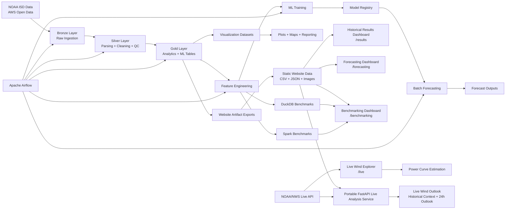
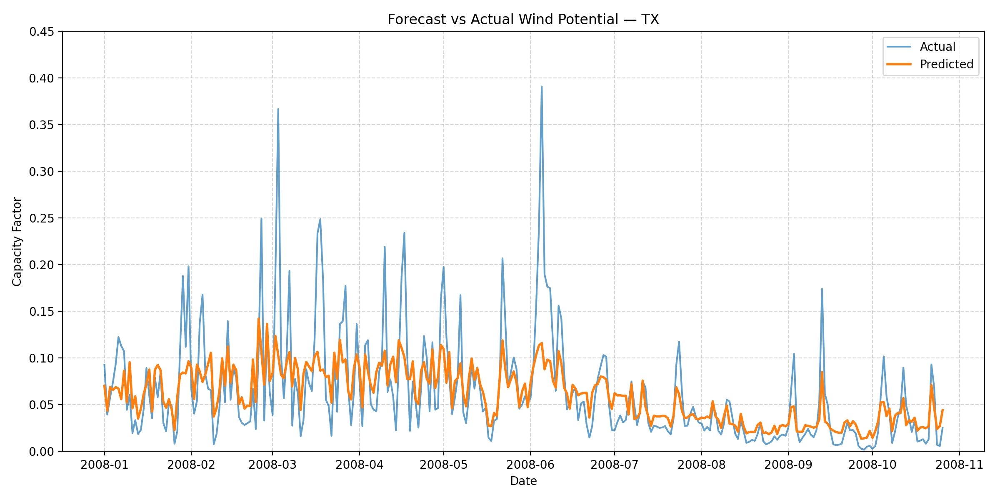
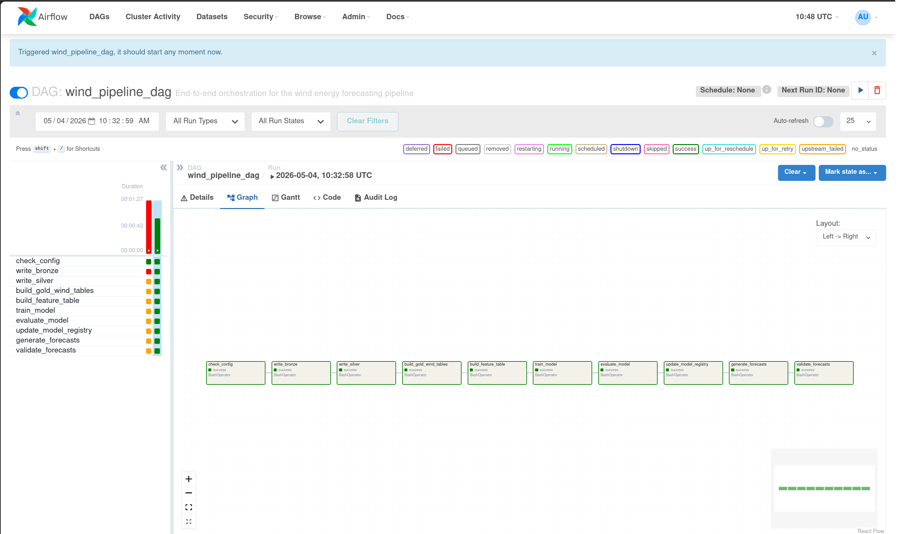
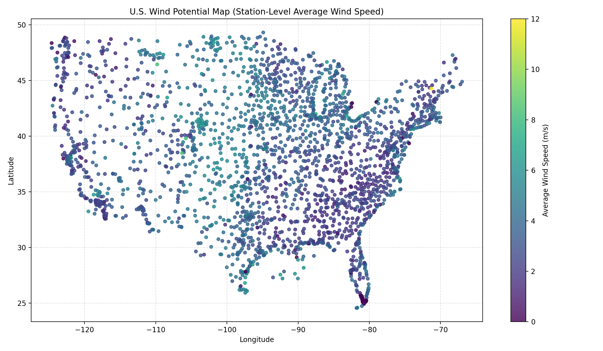
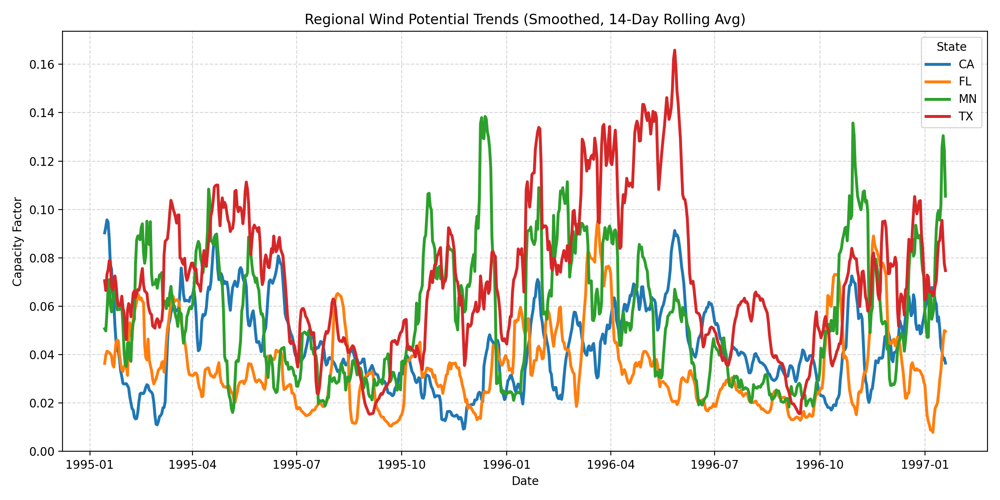
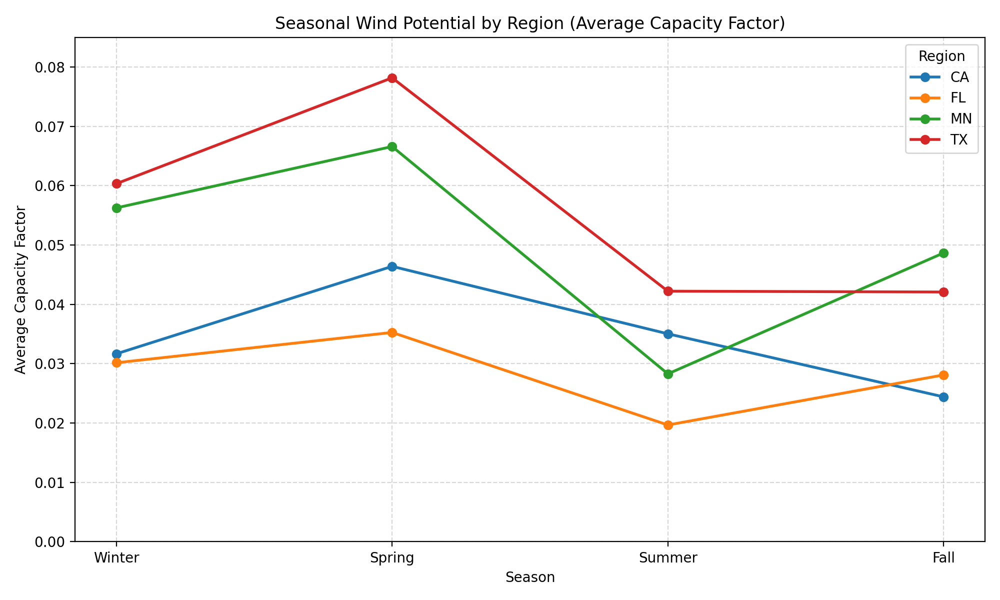

# Wind Energy Forecasting Platform

[]()
[]()
[]()
[]()
[]()
[]()
[]()
[]()
[]()

A production-style renewable energy forecasting platform built on NOAA Integrated Surface Database (ISD) data.

This project combines:

- large-scale distributed data engineering
- Spark-based ETL pipelines
- physics-informed wind energy modeling
- machine learning forecasting
- Apache Airflow orchestration
- cross-engine benchmarking
- analytical visualization
- static website artifact preservation
- historical pipeline dashboards
- interactive forecasting model diagnostics
- DuckDB vs Spark benchmark dashboards
- live NOAA-powered wind estimation
- deployable FastAPI live analysis service
- portable backend architecture using preserved Spark artifacts
- and a portfolio-grade web platform for demonstrating both historical analytics and live wind potential

The platform was designed to simulate a realistic end-to-end data + ML system capable of operating across local development, distributed cloud infrastructure, orchestration workflows, and deployable analytics interfaces.

---

# Project Objectives

The primary goals of this project are:

- build a scalable distributed forecasting pipeline using PySpark
- process NOAA ISD weather observations (~600GB+) efficiently
- convert raw meteorological observations into wind energy potential estimates
- engineer ML-ready forecasting datasets
- train and evaluate forecasting models for short-term wind prediction
- compare distributed vs single-node execution systems
- orchestrate workflows using Apache Airflow
- maintain reproducibility across users and environments
- generate analytical datasets and visual artifacts
- preserve final outputs so the project survives without EC2/S3
- build interactive historical dashboards from exported Spark artifacts
- build forecasting model evaluation dashboards from preserved model outputs
- build benchmarking dashboards from DuckDB and Spark runtime comparisons
- build a live web interface using current NOAA/NWS observations
- build a deployable FastAPI live analysis backend
- combine live NOAA observations with preserved Spark artifacts
- support portable non-Spark deployment after EC2/S3 expiration
- package the entire system into a deployable portfolio-grade product

---

# High-Level Architecture



---

# Dataset: NOAA Integrated Surface Database (ISD)

Source:

* NOAA ISD (AWS Open Data)

Characteristics:

* hourly global weather observations
* ~35,000 stations
* years: 1901–2025
* encoded wide-schema CSV format
* 600GB+ uncompressed scale

The dataset is large enough to require distributed processing for full-scale execution, but the project also supports local development on smaller subsets.

---

# Project Scope

## Geographic Scope

Contiguous United States.

The processed pipeline station universe currently covers:

* 48 states
* 2,419 processed pipeline stations
* 1,981 verified live NOAA/NWS stations mapped from processed station metadata

---

## Full Pipeline Window

1995–2025

The full historical analytical window is preserved in website-safe artifacts and used by the interactive historical dashboard.

Current full-window website exports include:

* 537,449 daily regional/state wind rows
* 5,904 seasonal trend rows
* 17,664 monthly state trend rows
* 1,488 yearly state summary rows
* 48 state-level long-run summaries
* 19,430,672 station-day records summarized into station-level exports
* 535,961 forecast-vs-actual evaluation rows

---

## Local Development Scope

Development subset used for rapid iteration:

* California
* Texas
* Minnesota
* Florida

Years:

* 2018–2020

Approximate station scope:

* ~150 stations

---

# Core Weather Fields

The pipeline focuses on NOAA ISD weather fields relevant to wind forecasting.

| Field | Purpose                    |
| ----- | -------------------------- |
| WND   | wind speed + direction     |
| TMP   | temperature                |
| DEW   | dew point                  |
| VIS   | visibility                 |
| CIG   | ceiling                    |
| SLP   | sea-level pressure         |
| DATE  | true observation timestamp |

---

# Important Engineering Constraints

Several important NOAA ISD characteristics influenced the pipeline design.

## Timestamp Handling

S3 object timestamps are not valid analytical timestamps.

All time logic uses:

```text
DATE
```

from the NOAA observations.

This rule is important because object storage metadata represents file upload or modification time, not the actual weather observation time.

---

## Encoded Weather Fields

Many NOAA fields are encoded string payloads that require custom parsing logic.

The project includes dedicated parsers for:

* WND
* TMP
* DEW
* VIS
* CIG
* SLP

These parsers convert NOAA encoded fields into typed, analysis-ready columns.

---

## Sparse Wide Dataset

The ISD dataset is extremely wide and sparse.

Version 1 intentionally focuses on:

* wind forecasting
* essential weather features
* scalable processing
* usable analytical outputs

rather than exhaustive coverage of every NOAA field.

---

# Technology Stack

## Distributed Processing

* PySpark
* Spark SQL
* Parquet

---

## Data Science

* Pandas
* NumPy
* PyArrow

---

## Machine Learning

* Spark MLlib
* Gradient Boosted Trees
* Random Forest
* Linear Regression

---

## Cloud Infrastructure

* AWS S3
* AWS EC2

---

## Workflow Orchestration

* Apache Airflow

---

## Benchmarking

* DuckDB
* Spark

---

## Visualization

* Plotly
* Datashader
* Matplotlib
* exported static figures
* Recharts dashboards in the Next.js frontend

---

## Website Platform

* Next.js
* TypeScript
* Tailwind CSS
* NOAA/NWS Weather API
* static CSV/JSON artifacts
* live browser-side wind estimation
* interactive historical pipeline dashboard
* interactive forecasting model dashboard
* interactive DuckDB vs Spark benchmarking dashboard

---

## Portable Backend Analysis Service

* FastAPI
* live NOAA observation ingestion
* portable backend architecture using preserved Spark artifacts
* historical contextualization service
* turbine-inspired live capacity-factor estimation
* next-24-hour outlook estimation
* deployable backend service
* Render / Railway / Fly.io

---

# Repository Structure

```text
configs/               → runtime + Spark + website configuration
data/                  → raw samples + benchmark inputs
data_contracts/        → schema + mapping definitions

docs/
├── architecture/      → system architecture and cloud execution docs
├── experiments/       → ETL, Airflow, modeling, and benchmark experiments
├── presentation/      → presentation and website planning materials
├── website/           → website product and deployment planning docs
└── assets/            → exported website-safe figures and images

infra/                 → AWS + Airflow infrastructure
notebooks/             → validation + EDA + experiments
outputs/               → generated figures + metrics + local artifacts
reports/               → final written reports
scripts/               → runnable orchestration + ETL + export scripts
src/                   → core pipeline source code
tests/                 → validation + unit tests
website_data/          → exported website-ready datasets

model_service/
├── app/               → FastAPI backend service
├── data/              → portable preserved backend artifacts
└── tests/             → backend validation tests

website/
├── public/
│   ├── assets/        → static figures used by the web app
│   └── data/          → frontend-safe CSV/JSON artifacts
├── src/
│   ├── app/           → Next.js app routes
│   ├── components/    → reusable UI components
│   ├── lib/           → NOAA client, station loading, CSV loading, power curve logic
│   └── types/         → TypeScript data contracts
└── tests/             → planned frontend utility tests

README.md
FINAL_REPORT.pdf
docker-compose.yml
pyproject.toml
uv.lock
```

---

# Source Code Organization

## Ingestion

```text
src/ingestion/
```

Handles:

* NOAA file discovery
* station filtering
* metadata loading
* raw ingestion

---

## Parsing

```text
src/parsing/
```

Contains dedicated parsers for NOAA encoded weather fields.

---

## Cleaning

```text
src/cleaning/
```

Handles:

* QC filtering
* null normalization
* sentinel value handling
* metadata enrichment
* unit standardization

---

## Storage

```text
src/storage/
```

Responsible for:

* bronze writes
* silver writes
* gold table generation
* repartitioning
* compaction

---

## Feature Engineering

```text
src/features/
```

Builds:

* lag features
* rolling statistics
* temporal features
* regional features

---

## Physics Modeling

```text
src/physics/
```

Implements:

* turbine-inspired power curves
* wind indices
* capacity factor logic

using Spark-native expressions.

---

## Machine Learning

```text
src/ml/
```

Contains:

* training pipelines
* tuning workflows
* dataset splitting
* inference logic
* model registry utilities

---

## Benchmarking

```text
src/benchmarking/
```

Implements:

* Spark benchmarks
* DuckDB benchmarks
* benchmark reporting

---

## Visualization

```text
src/visualization/
```

Generates:

* wind maps
* trend charts
* forecast validation plots
* seasonal visualizations

---

## Reporting

```text
src/reporting/
```

Exports:

* metrics
* reporting artifacts
* website-ready summaries

---

## Website Frontend

```text
website/src/
```

Implements:

* live NOAA station explorer
* station data loading
* live observation fetching
* power curve estimation
* portable FastAPI live analysis integration
* live wind outlook estimation
* historical contextualization
* interactive web UI
* static artifact consumption
* historical wind results dashboard
* ML forecasting dashboard
* DuckDB vs Spark benchmarking dashboard

Current important website files:

```text
website/src/lib/noaaClient.ts
website/src/lib/powerCurve.ts
website/src/lib/stationData.ts
website/src/lib/csv.ts
website/src/types/station.ts

website/src/components/LiveWindExplorer.tsx
website/src/components/PowerCurveChart.tsx
website/src/components/MapPanel.tsx
website/src/components/WindResultsExplorer.tsx
website/src/components/ForecastChart.tsx
website/src/components/MetricCard.tsx
website/src/components/BenchmarkChart.tsx

website/src/app/live/page.tsx
website/src/app/results/page.tsx
website/src/app/forecasting/page.tsx
website/src/app/benchmarking/page.tsx
```

---

# Setup

## Install Dependencies

```bash
uv sync
```

---

## Activate Environment

```bash
source .venv/bin/activate
```

---

## Verify Environment

```bash
which python
```

---

# Website Setup

The website is a separate Next.js application inside:

```text
website/
```

## Install Website Dependencies

```bash
cd website
npm install
```

---

## Run Website Locally

```bash
npm run dev
```

The local development server opens at:

```text
http://localhost:3000
```

The live wind explorer is available at:

```text
http://localhost:3000/live
```

The historical wind results dashboard is available at:

```text
http://localhost:3000/results
```

The forecasting model dashboard is available at:

```text
http://localhost:3000/forecasting
```

The benchmarking dashboard is available at:

```text
http://localhost:3000/benchmarking
```

---

## Website Verification Commands

During development, keep this running:

```bash
npm run dev
```

Use this after important TypeScript changes:

```bash
npx tsc --noEmit
```

Use this before considering a website milestone complete or before deployment:

```bash
npm run build
```

Normal workflow:

```text
edit code → browser auto-refreshes
```

Final verification workflow:

```bash
npx tsc --noEmit
npm run build
```

---

# Portable Backend Service Setup

The project includes a deployable FastAPI backend service for live wind analysis.

Location:

```text
model_service/
```

## Backend Service Features

The service provides:

* live NOAA/NWS observation ingestion
* turbine-inspired capacity-factor estimation
* historical contextualization using preserved Spark artifacts
* next-24-hour outlook estimation
* validated live station enforcement
* portable deployment without Spark runtime dependencies

## Run Backend Service

From repository root:

```bash
uvicorn model_service.app.main:app --reload --port 8000
```

Backend Swagger UI:

```text
http://127.0.0.1:8000/docs
```

## Backend Environment Variables

```bash
export FRONTEND_ORIGINS=http://localhost:3000,http://127.0.0.1:3000
```

---

# Configuration System

The pipeline is fully config-driven to support:

* multiple users
* different AWS environments
* local execution
* distributed execution
* reproducibility
* website artifact export

---

## Never Hardcode

The project intentionally avoids hardcoding:

* S3 buckets
* EC2 hostnames
* Spark URLs
* runtime paths
* output directories
* website artifact paths

---

## Shared Configs

Located in:

```text
configs/
```

Includes:

* Spark settings
* runtime defaults
* schemas
* modeling configs
* website configs
* deployment configs
* project paths

---

## User Configs

Located in:

```text
configs/users/
```

Defines:

* AWS resources
* EC2 access
* runtime locations
* Spark master URLs

---

## Active Runtime Config

```bash
export PROJECT_USER_CONFIG=configs/users/syed.yaml
```

---

# Development Workflow

The project follows a scalable development pattern.

1. build locally on small samples
2. validate with notebooks + tests
3. scale to Spark cluster execution
4. validate distributed outputs
5. orchestrate via Airflow
6. export analytical artifacts
7. preserve portable website datasets
8. build live website features
9. build historical website dashboards
10. build forecasting model dashboards
11. build benchmarking dashboards
12. package for deployment

---

# End-to-End Pipeline Flow

```text
raw NOAA ingestion
→ parsing
→ cleaning
→ enrichment
→ standardization
→ aggregation
→ analytics
→ feature engineering
→ ML-ready datasets
→ model training
→ model evaluation
→ model registry
→ batch inference
→ forecast validation
→ benchmarking
→ visualization exports
→ website-ready artifact generation
→ historical dashboard rendering
→ forecasting dashboard rendering
→ benchmarking dashboard rendering
→ live NOAA web integration
```

---

# Data Processing

## Raw NOAA Structure

NOAA ISD data organization:

```text
year/station.csv
```

Each file represents:

* a station-year

Each row represents:

* a timestamped weather observation

---

# Cleaning and Quality Control

The cleaning stage performs:

* sentinel value replacement
* malformed record handling
* numeric parsing
* metadata joins
* quality filtering
* unit normalization

Examples:

```text
9999
+9999
```

converted into:

```text
NULL
```

---

# Data Lake Architecture

## Bronze Layer

Purpose:

* raw NOAA ingestion
* normalized ingestion schema
* resilient distributed loading

Output:

```text
s3a://<user-bucket>/bronze/isd
```

---

## Silver Layer

Purpose:

* parsed weather fields
* quality-controlled records
* standardized units
* metadata enrichment

Partitioning:

* year
* state

Output:

```text
s3a://<user-bucket>/silver/weather
```

---

## Gold Layer

Purpose:

* analytical datasets
* ML-ready datasets
* forecasting aggregates
* benchmark-ready tables

Gold outputs power downstream analytics, model training, forecast validation, visualization exports, benchmark exports, and website-ready artifacts.

---

# Wind Energy Modeling

## Wind Potential Definition

Wind potential is represented using:

```text
capacity factor
```

normalized between:

```text
0 and 1
```

Capacity factor represents estimated normalized wind energy output. A value of 0 means no estimated output, and a value near 1 means rated output.

In the website dashboards, capacity factor is often displayed as a percentage for readability.

Example:

```text
0.05 = 5% wind potential score
```

These values should be interpreted as conservative wind-resource estimates derived from weather observations and turbine-inspired logic, not direct measurements of turbine production.

---

## Physics-Based Modeling

The project includes turbine-inspired wind logic:

* cut-in speed
* rated speed
* cut-out speed
* wind power density estimation
* capacity factor estimation

All implemented using Spark-native transformations in the data pipeline.

No Python UDFs are used in production ETL logic.

---

## Power Curve Used by the Website

The live website implements the same simplified turbine-inspired power curve concept in TypeScript:

| Wind Speed Range | Interpretation                                        |
| ---------------- | ----------------------------------------------------- |
| below 3 m/s      | below cut-in, estimated output is 0                   |
| 3–12 m/s         | ramp-up region, output increases nonlinearly          |
| 12–25 m/s        | rated region, estimated output is near full           |
| above 25 m/s     | turbine cuts out to protect equipment in extreme wind |

This allows live NOAA wind observations to be converted into an estimated capacity factor directly in the browser.

---

# Gold Analytical Outputs

## Daily Regional Wind Table

```text
s3a://<user-bucket>/gold/wind/analytics/daily_region
```

---

## Monthly State Wind Table

```text
s3a://<user-bucket>/gold/wind/analytics/monthly_state
```

---

## Extreme Event Table

```text
s3a://<user-bucket>/gold/wind/analytics/extreme_events
```

---

## Daily Region Table Used for Website Trends

```text
s3a://<user-bucket>/gold/wind/region/daily
```

This table is exported into:

```text
website/public/data/regional_trends.csv
website/public/data/seasonal_trends.csv
website/public/data/monthly_state_trends.csv
website/public/data/yearly_state_summary.csv
website/public/data/state_wind_summary.csv
```

These files power the interactive `/results` dashboard.

---

## Station Daily Table Used for Website Station Summaries

```text
s3a://<user-bucket>/gold/wind/station/daily
```

This table is summarized into:

```text
website/public/data/top_wind_stations.csv
```

and supports station-level wind-resource analysis on the website.

---

# Machine Learning Pipeline

## ML Base Table

```text
s3a://<user-bucket>/gold/wind/ml/base
```

---

## Feature Engineering

Feature generation includes:

* lag features
* rolling statistics
* temporal features
* weather aggregates
* regional features

---

## Dataset Splits

Time-based splitting strategy:

| Split      | Years     |
| ---------- | --------- |
| Train      | ≤ 2019    |
| Validation | 2020–2022 |
| Test       | ≥ 2023    |

---

# Forecasting Models

Models evaluated:

* Baseline
* Linear Regression
* Random Forest
* Gradient Boosted Trees (GBT)

---

# Final Selected Model

```text
final_tuned_gbt
```

---

# Forecasting Performance

| Metric | Value  |
| ------ | ------ |
| RMSE   | ~0.042 |
| MAE    | ~0.025 |

---

## Forecast vs Actual



---

# Model Registry

```text
s3a://<user-bucket>/models/registry/
```

The final selected model is registered under:

```text
s3a://<user-bucket>/models/registry/final_gbt/
```

Model metadata exported for website/model documentation includes:

```text
website/public/data/model_pipeline_summary.json
website/public/data/model_hyperparameters.json
website/public/data/true_feature_importance.json
```

These exports preserve model details even when the Spark model registry is not directly available from the deployed website.

---

# Batch Inference Outputs

Forecast outputs stored in:

```text
s3a://<user-bucket>/forecasts/outputs/
```

The final historical forecast export used by the website is preserved in:

```text
website/public/data/forecast_vs_actual.csv
```

This file joins model predictions with actual next-day outcomes so the website can evaluate model performance interactively.

---

# Forecast Validation Metrics

| Metric | Value   |
| ------ | ------- |
| MAE    | ~0.0275 |
| RMSE   | ~0.0455 |
| Bias   | ~0      |

The website displays these metrics as percentage points of capacity factor:

| Metric | Website Display |
| ------ | --------------- |
| RMSE   | ~4.55%          |
| MAE    | ~2.75%          |
| Bias   | ~0.02%          |

A near-zero bias indicates that the model is not consistently overpredicting or underpredicting wind potential.

---

# Forecasting Scope

The forecasting dashboard currently shows historical holdout evaluation, not live future forecasting.

The selectable forecast years are:

```text
2023–2025
```

These years are used because actual outcomes are already known, allowing direct comparison between:

```text
prediction
vs
actual next-day capacity factor
```

This supports honest model evaluation using RMSE, MAE, and bias.

The project now includes a deployable portable FastAPI live analysis service.

The live backend currently performs:

* live NOAA observation ingestion
* turbine-inspired live capacity-factor estimation
* historical contextualization from preserved Spark artifacts
* next-24-hour outlook estimation

The service intentionally does not claim live Spark ML inference.

True operational future forecasting would still require:

---

# Apache Airflow Orchestration

The project includes a production-style orchestration layer using Apache Airflow.

Main DAG:

```text
wind_pipeline_dag
```

---

## DAG Responsibilities

* config validation
* bronze ingestion
* silver generation
* gold table generation
* feature table generation
* model training
* evaluation
* model registration
* forecast generation
* validation

---

## Airflow Execution Modes

### Dry Run Mode

Used for:

* demonstrations
* DAG validation
* safe orchestration testing

---

### Full Execution Mode

Runs actual distributed workloads.

Example:

```bash
bash scripts/run_bronze_full_us.sh
```

---

# Airflow Observability

The Airflow environment supports:

* Graph View
* Gantt View
* task logs
* dependency tracing
* execution monitoring

---

## Airflow DAG Graph



---

# Benchmarking: DuckDB vs Spark

The project benchmarks:

* single-node analytical execution

vs

* distributed Spark execution

using equivalent workloads.

---

# Benchmark Tasks

Included benchmark operations:

* filtering
* aggregations
* grouped summaries
* metadata joins

---

# Benchmark Results

Key findings:

* DuckDB performs exceptionally well on smaller local workloads
* Spark incurs scheduling overhead
* Spark becomes necessary at larger distributed scales
* warm Spark runs improve performance

The benchmark is not intended to prove Spark is always faster.

Instead, it demonstrates the tradeoff:

```text
DuckDB → excellent for compact local analytics
Spark  → appropriate for distributed, partitioned, cloud-scale workloads
```

This is an important architectural conclusion because the project supports both:

* local development and analysis
* distributed full-scale processing on EC2/S3

---

# Benchmark Outputs

```text
outputs/benchmark_results/
├── duckdb_benchmarks.csv
├── spark_benchmarks.csv
├── benchmark_comparison.csv
└── benchmark_summary.csv
```

Website-safe benchmark artifacts are preserved in:

```text
website/public/data/
├── benchmark_comparison.csv
├── benchmark_summary.csv
├── duckdb_benchmarks.csv
└── spark_benchmarks.csv
```

Website benchmark figures are preserved in:

```text
website/public/assets/
├── benchmark_runtime_by_task.png
└── benchmark_runtime_ratio.png
```

---

# Final Visual Outputs

## U.S. Wind Potential Map



---

## Regional Wind Trends



---

## Seasonal Wind Trends



---

## Forecast vs Actual


---

## Benchmark Runtime by Task

```text
website/public/assets/benchmark_runtime_by_task.png
```

---

## Spark Runtime Relative to DuckDB

```text
website/public/assets/benchmark_runtime_ratio.png
```

---

# Website Artifact Preservation

To ensure the project remains functional even after EC2/S3 expiration, portable frontend-safe artifacts are exported locally.

Current preserved artifacts include:

## Website Data Exports

```text
website/public/data/
├── all_pipeline_stations.json
├── benchmark_comparison.csv
├── benchmark_summary.csv
├── duckdb_benchmarks.csv
├── feature_importance.json
├── forecast_vs_actual.csv
├── live_station_api_verification_audit.json
├── live_station_list.json
├── live_station_mapping_audit.csv
├── model_hyperparameters.json
├── model_metrics.json
├── model_pipeline_summary.json
├── monthly_state_trends.csv
├── pipeline_summary.json
├── regional_trends.csv
├── seasonal_trends.csv
├── spark_benchmarks.csv
├── state_wind_summary.csv
├── top_wind_stations.csv
├── true_feature_importance.json
├── us_wind_station_map.csv
├── verified_live_station_list.json
└── yearly_state_summary.csv
```

---

## Website Asset Exports

```text
website/public/assets/
├── airflow_dag_graph_success.png
├── benchmark_runtime_by_task.png
├── benchmark_runtime_ratio.png
├── forecast_vs_actual.png
├── regional_wind_trends.png
├── seasonal_trends.png
└── us_wind_potential_map.png
```

---

## Artifact Validation

Validation scripts ensure:

* all exported images exist
* CSV schemas are readable
* JSON files are valid
* frontend datasets remain lightweight
* portable artifacts remain deployable
* station artifacts are available for website use
* forecast evaluation files contain actual and prediction columns
* benchmark files contain DuckDB and Spark runtime comparisons
* model metadata files preserve model identity and feature interpretation

---

# Historical Pipeline Dashboard

The website includes a completed historical pipeline dashboard.

Route:

```text
/results
```

Implemented files:

```text
website/src/app/results/page.tsx
website/src/components/MapPanel.tsx
website/src/components/WindResultsExplorer.tsx
website/src/lib/csv.ts
```

This dashboard demonstrates the value of the Spark historical pipeline through interactive charts and preserved artifacts.

## What the Results Dashboard Shows

The `/results` page displays:

* U.S. wind potential map
* full 1995–2025 historical state coverage
* monthly wind profile by state and year
* 31-year wind potential trend by state
* strongest long-run wind resource states
* highest-wind processed weather sites
* capacity-factor interpretation blocks
* pipeline coverage summary cards

## Results Dashboard Inputs

```text
website/public/assets/us_wind_potential_map.png
website/public/data/pipeline_summary.json
website/public/data/regional_trends.csv
website/public/data/seasonal_trends.csv
website/public/data/monthly_state_trends.csv
website/public/data/yearly_state_summary.csv
website/public/data/state_wind_summary.csv
website/public/data/top_wind_stations.csv
website/public/data/us_wind_station_map.csv
```

## What This Dashboard Proves

The results dashboard shows that the Spark pipeline produced reusable analytical artifacts across the full historical window.

It turns distributed batch outputs into a lightweight, deployable, frontend-safe dashboard that remains usable even after EC2 or S3 resources are shut down.

---

# Forecasting Model Dashboard

The website includes a completed forecasting model dashboard.

Route:

```text
/forecasting
```

Implemented files:

```text
website/src/app/forecasting/page.tsx
website/src/components/ForecastChart.tsx
website/src/components/MetricCard.tsx
```

## What the Forecasting Dashboard Shows

The `/forecasting` page displays:

* final selected model name
* model family
* RMSE
* MAE
* bias
* evaluation row count
* target variable
* coverage window
* forecast vs actual chart
* feature importance chart
* sample prediction table
* historical holdout interpretation
* model interpretation notes

## Forecasting Dashboard Inputs

```text
website/public/data/forecast_vs_actual.csv
website/public/data/model_metrics.json
website/public/data/feature_importance.json
website/public/data/true_feature_importance.json
website/public/data/model_hyperparameters.json
website/public/data/model_pipeline_summary.json
```

## How to Interpret the Forecasting Dashboard

The model predicts:

```text
next_day_daily_region_capacity_factor
```

This is a next-day regional wind-potential target.

The dashboard focuses on historical holdout years:

```text
2023–2025
```

because actual outcomes are known for those dates.

This allows the website to compare:

```text
forecast prediction
vs
actual observed next-day wind potential
```

## Forecasting Model Takeaways

Key observations:

* the model tracks normal wind-potential movement reasonably well
* wind-speed features dominate prediction importance
* rolling capacity-factor features improve stability
* largest forecast errors occur during sudden wind spikes
* near-zero bias means the model is not consistently overpredicting or underpredicting

The model is intentionally presented as historical evaluation rather than live future prediction.

---

# Benchmarking Dashboard

The website includes a completed DuckDB vs Spark benchmarking dashboard.

Route:

```text
/benchmarking
```

Implemented files:

```text
website/src/app/benchmarking/page.tsx
website/src/components/BenchmarkChart.tsx
website/src/components/MetricCard.tsx
website/src/components/MapPanel.tsx
website/src/lib/csv.ts
```

## What the Benchmarking Dashboard Shows

The `/benchmarking` page displays:

* DuckDB vs Spark runtime comparison
* benchmark summary
* static benchmark runtime figures
* Spark-to-DuckDB runtime ratio figure
* interactive benchmark runtime chart
* interpretation of when DuckDB is useful
* interpretation of when Spark is justified
* project-level benchmarking takeaway

## Benchmarking Dashboard Inputs

```text
website/public/data/benchmark_comparison.csv
website/public/data/benchmark_summary.csv
website/public/data/duckdb_benchmarks.csv
website/public/data/spark_benchmarks.csv
website/public/assets/benchmark_runtime_by_task.png
website/public/assets/benchmark_runtime_ratio.png
```

## Benchmarking Takeaway

DuckDB is excellent for small local analytical workloads and fast iteration.

Spark can be slower on small local data because of scheduling overhead, but it becomes the correct tool when processing:

* multi-year NOAA partitions
* many states
* many weather stations
* large Parquet tables
* S3-backed distributed data
* full production-style pipeline workloads

This dashboard explains why both engines exist in the project.

---

# Website Layer 4 Completion

Website Layer 4 is complete.

It includes:

## Part A — Wind Potential Results Page

Route:

```text
/results
````

Output:

```text
Wind results dashboard
```

Status:

```text
complete
```

## Part B — Forecasting Model Page

Route:

```text
/forecasting
```

Output:

```text
ML model results page
```

Status:

```text
complete
```

## Part C — Benchmarking Page

Route:

```text
/benchmarking
```

Output:

```text
Benchmarking dashboard
```

Status:

```text
complete
```

## Part D — Portable Live Analysis Service

Route:

```text
/live
```

Output:

```text
Deployable live wind outlook backend service
```

Status:

```text
complete
```

## Layer 4 Completion Criteria

The website and backend now explain, display, and serve project outputs through:

* static artifacts
* interactive charts
* preserved CSV/JSON outputs
* forecasting diagnostics
* model interpretation
* benchmark interpretation
* live NOAA observations
* FastAPI backend analysis service
* live wind outlook estimation
* historical contextualization
* user-facing explanatory text

Layer 4 extends the project into a deployable live analysis platform with portable backend infrastructure.

---

# How the Processed Pipeline Data Is Used in the Website

The live website is not only calling a public weather API. It is built on top of the processed Spark pipeline outputs.

The website currently uses processed pipeline data in the following ways.

---

## 1. Processed Station Universe

The website uses:

```text
website/public/data/us_wind_station_map.csv
```

and:

```text
website/public/data/all_pipeline_stations.json
```

to represent the station universe produced by the pipeline.

These files come from the processed wind station map export, not directly from the live NOAA API.

They contain:

* processed station IDs
* latitude
* longitude
* state
* historical average wind speed
* pipeline source labels

Current coverage:

| Artifact                    | Count     |
| --------------------------- | --------- |
| processed pipeline stations | 2,419     |
| state coverage              | 48 states |

This means the website station layer is grounded in the stations that passed the pipeline’s filtering, enrichment, and aggregation process.

---

## 2. Historical Wind Context

The station details shown in the live explorer include:

```text
Historical avg wind speed
```

This value comes from the processed pipeline export.

It is not provided by the NOAA live observation endpoint.

This lets the website show both:

* current live wind speed
* historical average wind speed from the pipeline

for the selected station.

---

## 3. ISD to ICAO/NWS Station Mapping

The pipeline station IDs are NOAA ISD-style identifiers.

The NOAA/NWS live API expects ICAO/NWS-style station identifiers such as:

```text
KSFO
KMSP
KIAH
KMIA
```

To bridge this gap, the project builds a mapping layer:

```text
ISD station ID
→ NOAA station metadata
→ ICAO/NWS station ID
→ live NOAA endpoint
```

This mapping produces:

```text
website/public/data/live_station_list.json
website/public/data/verified_live_station_list.json
website/public/data/live_station_mapping_audit.csv
website/public/data/live_station_api_verification_audit.json
```

Current live station coverage:

| Artifact                         | Count     |
| -------------------------------- | --------- |
| ICAO/NWS candidate live stations | 2,040     |
| verified live NOAA stations      | 1,981     |
| verified live state coverage     | 48 states |

This is why the live explorer can support nationwide live station search instead of only a small manually selected list.

---

## 4. Live Station Verification

The project verifies candidate live stations by checking the NOAA/NWS endpoint:

```text
https://api.weather.gov/stations/{stationId}/observations/latest
```

Only stations that respond successfully are exported into:

```text
website/public/data/verified_live_station_list.json
```

The frontend uses this verified list for the live explorer.

This prevents the UI from presenting stations that are unlikely to work with live NOAA observations.

---

## 5. Forecast and Model Artifacts

The website preserves model and forecast outputs from the pipeline:

```text
website/public/data/forecast_vs_actual.csv
website/public/data/model_metrics.json
website/public/data/feature_importance.json
website/public/data/true_feature_importance.json
website/public/data/model_hyperparameters.json
website/public/data/model_pipeline_summary.json
```

These artifacts support website sections for:

* forecast validation
* model performance
* feature importance
* forecasting results
* model metadata preservation
* model interpretability

---

## 6. Trend and Map Artifacts

The website preserves analytical exports:

```text
website/public/data/regional_trends.csv
website/public/data/seasonal_trends.csv
website/public/data/monthly_state_trends.csv
website/public/data/yearly_state_summary.csv
website/public/data/state_wind_summary.csv
website/public/data/top_wind_stations.csv
website/public/data/us_wind_station_map.csv
```

These support website sections for:

* regional wind trends
* seasonal capacity factor patterns
* monthly wind profiles
* state-level long-run wind summaries
* station-level wind potential summaries
* station-level wind potential maps

---

## 7. Benchmark Artifacts

The website preserves benchmark outputs:

```text
website/public/data/benchmark_comparison.csv
website/public/data/benchmark_summary.csv
website/public/data/duckdb_benchmarks.csv
website/public/data/spark_benchmarks.csv
```

These support website sections for:

* DuckDB vs Spark runtime comparison
* benchmark summary
* cross-engine interpretation
* analytical engine tradeoff explanation

---

## 8. Static Figures

The website also uses pipeline-generated or notebook-generated figures:

```text
website/public/assets/forecast_vs_actual.png
website/public/assets/regional_wind_trends.png
website/public/assets/seasonal_trends.png
website/public/assets/us_wind_potential_map.png
website/public/assets/airflow_dag_graph_success.png
website/public/assets/benchmark_runtime_by_task.png
website/public/assets/benchmark_runtime_ratio.png
```

These are generated from the analysis, visualization, and benchmarking layers, then copied into frontend-safe static assets.

---

# Live NOAA Wind Estimator

The website currently includes a working live wind estimator.

Route:

```text
/live
```

Implemented files:

```text
website/src/lib/noaaClient.ts
website/src/lib/powerCurve.ts
website/src/lib/stationData.ts
website/src/components/LiveWindExplorer.tsx
website/src/components/PowerCurveChart.tsx
website/src/app/live/page.tsx
website/src/types/station.ts
```

---

## What The Live Estimator And Backend Service Are Not Yet

The live estimator:

1. loads verified live stations from local website artifacts
2. allows filtering by state
3. allows searching by station code, name, or state
4. fetches the latest NOAA/NWS live observation
5. extracts:

   * wind speed
   * wind direction
   * temperature
   * observation timestamp
6. converts live wind speed into estimated capacity factor
7. displays the operating point on a turbine power curve
8. shows observation metadata and observation age
9. handles NOAA API failures with a fallback state

---

## What Comes from NOAA Live API

The live NOAA/NWS API provides:

* current wind speed
* current wind direction
* current temperature
* observation timestamp

The endpoint used is:

```text
https://api.weather.gov/stations/{stationId}/observations/latest
```

---

## What Comes from the Pipeline

The pipeline provides:

* station universe
* station coordinates
* state filtering
* historical average wind speed
* ISD to ICAO/NWS station mapping
* live station verification inputs
* trend artifacts
* map artifacts
* model metrics
* forecast validation artifacts
* benchmark artifacts
* dashboard-ready summaries

The website combines both systems:

```text
processed historical Spark pipeline artifacts
+
live NOAA/NWS observations
+
power curve estimation
```

---

## What the Live Estimator Is Not Yet

The live estimator is not yet:

* live Spark inference
* live GBT inference
* real-time feature engineering
* streaming prediction
* deployed backend ML inference
* future-date operational forecasting

The project now includes a deployable backend analysis service, but it intentionally avoids claiming live Spark ML inference.

The current live platform combines:

* real-time NOAA observations
* turbine-inspired power-curve estimation
* preserved Spark pipeline artifacts
* deployable FastAPI backend services
* historical contextualization
* next-24-hour outlook estimation

---

# Portable FastAPI Live Analysis Service

The project includes a deployable backend service for live wind analysis.

Route integration:

```text
/live
```

Backend service location:

```text
model_service/
```

Implemented backend files:

```text
model_service/app/main.py
model_service/app/noaa_client.py
model_service/app/live_analyzer.py
model_service/app/power_curve.py
model_service/app/artifact_loader.py
model_service/app/schemas.py
```

## What the Backend Service Does

The backend service:

1. validates live station IDs against preserved verified station artifacts
2. fetches live NOAA/NWS observations
3. extracts:

   * live wind speed
   * live wind direction
   * live temperature
   * observation timestamp
4. converts wind speed into estimated live capacity factor
5. compares current conditions against historical Spark artifact summaries
6. estimates a next-24-hour outlook range
7. returns deployable JSON API responses
8. supports frontend integration through FastAPI endpoints
9. supports portable deployment without Spark runtime dependencies

## Backend Service Endpoints

```text
GET  /health
GET  /metrics
GET  /stations
POST /analyze-live
```

## What the Backend Service Is

The backend service is:

* deployable
* portable
* frontend-compatible
* artifact-driven
* infrastructure-independent
* technically honest about live inference limitations

## What the Backend Service Is Not

The backend service is not:

* live Spark inference
* real-time feature engineering
* streaming ML prediction
* future-weather operational forecasting
* retrained portable XGBoost inference

The backend intentionally avoids making misleading live-ML claims while still demonstrating realistic deployment architecture.

---

# Testing

The repository includes unit and validation tests for:

* parsers
* unit conversions
* feature generation
* model IO
* quality filters
* power curve logic

Test suite location:

```text
tests/
```

Website validation commands:

```bash
cd website
npx tsc --noEmit
npm run build
```

---

# Current Website Platform Work

The project is currently being extended into a live portfolio-grade forecasting platform.

Current website and backend capabilities include:

* Next.js application setup
* static asset preservation
* website-ready CSV/JSON exports
* verified nationwide live station list
* live NOAA observation fetcher
* browser-side power curve estimation
* FastAPI portable backend service
* live wind outlook estimation
* backend historical contextualization
* deployable backend API architecture
* live station search and filtering
* fallback state for NOAA API failures
* historical wind results dashboard
* forecasting model evaluation dashboard
* DuckDB vs Spark benchmarking dashboard
* dashboard interpretation blocks
* static and interactive artifact display

Planned capabilities include:

* deployable ML inference
* production forecasting API
* future-date prediction workflow
* backend model service
* public cloud deployment
* monitoring and model drift documentation

---

# Planned Website Stack

## Frontend

* Next.js
* TypeScript
* Tailwind CSS
* Plotly / Chart.js
* Recharts

---

## Backend

* FastAPI
* NOAA Weather API integration
* portable backend analysis service
* preserved Spark artifact contextualization
* deployable live wind outlook service

---

## Deployment

* Vercel
* Render / Railway

---

# Website Product Direction

The website separates:

## Historical Pipeline Results

Precomputed artifacts exported from Spark:

* trends
* forecasts
* metrics
* benchmark outputs
* visualizations
* station metadata

from

## Historical Forecast Evaluation

Model predictions joined with actual outcomes:

* forecast vs actual
* RMSE
* MAE
* bias
* feature importance
* sample prediction rows
* holdout-year interpretation

from

## Live Wind Estimation And Outlook Service

Real-time NOAA weather observations combined with:

* turbine-inspired power curve logic
* verified station mappings
* preserved Spark pipeline artifacts
* deployable FastAPI backend analysis service
* historical contextualization
* next-24-hour outlook estimation

---

# Current Website Planning Docs

```text
docs/website/
├── data_export_plan.md
├── deployment_plan.md
├── live_prediction_design.md
└── product_spec.md
```

---

# Engineering Principles

Core project rules:

* all paths must come from config
* infrastructure must remain environment-agnostic
* timestamps must use true NOAA observation times
* orchestration must remain separate from business logic
* validation occurs before scaling
* portable artifacts should outlive cloud infrastructure
* website data must be lightweight and deployable
* historical dashboards must use preserved artifacts
* forecast dashboards must distinguish evaluation from future prediction
* benchmark dashboards must explain engine tradeoffs honestly
* live claims must be technically honest

---

# Final Outcome

This project demonstrates:

* distributed data engineering
* scalable ETL architecture
* Spark-based processing
* ML forecasting systems
* Airflow orchestration
* benchmarking methodology
* reproducible infrastructure
* analytical visualization
* website-ready artifact preservation
* historical pipeline dashboards
* forecasting model dashboards
* benchmark dashboards
* nationwide live NOAA station integration
* live physics-based wind estimation
* deployable FastAPI backend service
* portable backend architecture
* live wind outlook estimation
* historical contextualization from preserved Spark artifacts
* production-style packaging
* deployable forecasting platform design

---

# Ready For

* forecasting systems
* renewable energy analytics
* distributed ETL pipelines
* Airflow orchestration
* ML engineering workflows
* analytical dashboards
* live forecasting interfaces
* deployable FastAPI services
* portable analytics backends
* live environmental analytics APIs
* production deployment
* technical portfolio demonstrations
* MLOps-style inference service extension
* production forecasting infrastructure
