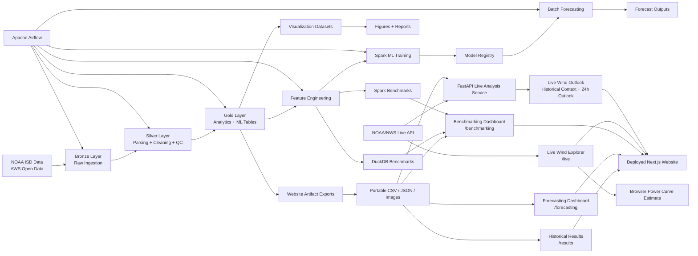

# Wind Energy Forecasting Platform

**Live Website:** https://renewable-energy-forecasting-pipeli.vercel.app/

[]()
[]()
[]()
[]()
[]()
[]()
[]()
[]()
[]()
[]()
[]()

A production-style wind energy forecasting and analytics platform built on NOAA Integrated Surface Database (ISD) weather observations.

This project combines:

- large-scale distributed data engineering
- Spark-based ETL pipelines
- NOAA ISD weather parsing and quality control
- physics-informed wind energy modeling
- machine learning forecasting
- Apache Airflow orchestration
- DuckDB vs Spark benchmarking
- analytical visualization
- website-safe artifact preservation
- historical wind analytics dashboards
- interactive forecasting diagnostics
- live NOAA-powered wind estimation
- deployable FastAPI live analysis backend
- deployed Next.js portfolio website

The platform simulates a realistic end-to-end data and ML system capable of operating across local development, distributed cloud infrastructure, orchestration workflows, preserved analytical artifacts, backend APIs, and public web deployment.

---

# Deployed Product

## Public Website

```text
https://renewable-energy-forecasting-pipeli.vercel.app/
````

## Website Routes

```text
/               → project overview
/live           → live NOAA wind explorer + backend wind outlook
/pipeline       → architecture and pipeline explanation
/results        → historical wind analytics dashboard
/forecasting    → ML forecasting evaluation dashboard
/benchmarking   → DuckDB vs Spark benchmarking dashboard
```

## Backend Service

The project includes a deployed FastAPI backend service for live wind outlook analysis.

Backend capabilities:

* validates live NOAA station IDs
* fetches latest NOAA/NWS observations
* estimates live wind capacity factor
* compares live conditions against preserved historical Spark artifacts
* returns a next-24-hour wind outlook
* serves deployable JSON API responses without Spark runtime dependencies

Backend endpoints:

```text
GET  /health
GET  /metrics
GET  /stations
POST /analyze-live
```

---

# Project Objectives

The primary goals of this project are:

* build a scalable distributed forecasting pipeline using PySpark
* process NOAA ISD weather observations efficiently
* convert raw meteorological observations into wind energy potential estimates
* engineer ML-ready forecasting datasets
* train and evaluate short-term wind forecasting models
* compare distributed and single-node execution systems
* orchestrate workflows using Apache Airflow
* preserve final outputs so the project remains usable without EC2/S3
* build interactive historical dashboards from exported Spark artifacts
* build model evaluation dashboards from preserved forecast outputs
* build benchmarking dashboards from DuckDB and Spark runtime comparisons
* build a live web interface using current NOAA/NWS observations
* build a deployable FastAPI live analysis backend
* deploy the product publicly as a portfolio-grade analytics platform

---

# High-Level Architecture



---

# Dataset: NOAA Integrated Surface Database

Source:

* NOAA ISD AWS Open Data

Characteristics:

* hourly global weather observations
* approximately 35,000 stations
* years: 1901–2025
* encoded wide-schema CSV format
* 600GB+ uncompressed scale

The dataset is large enough to justify distributed processing for full-scale execution, while the project also supports local development on smaller subsets.

---

# Project Scope

## Geographic Scope

Contiguous United States.

Current processed station coverage:

| Scope                           |     Count |
| ------------------------------- | --------: |
| processed pipeline stations     |     2,419 |
| verified live NOAA/NWS stations |     1,981 |
| state coverage                  | 48 states |

---

## Full Pipeline Window

```text
1995–2025
```

Current preserved website exports include:

| Artifact                                                  |      Count |
| --------------------------------------------------------- | ---------: |
| daily regional/state wind rows                            |    537,449 |
| seasonal trend rows                                       |      5,904 |
| monthly state trend rows                                  |     17,664 |
| yearly state summary rows                                 |      1,488 |
| state-level long-run summaries                            |         48 |
| station-day records summarized into station-level exports | 19,430,672 |
| forecast-vs-actual evaluation rows                        |    535,961 |

---

## Local Development Scope

Development subset used for rapid iteration:

* California
* Texas
* Minnesota
* Florida

Years:

```text
2018–2020
```

Approximate local station scope:

```text
~150 stations
```

---

# Core Weather Fields

| Field | Purpose                    |
| ----- | -------------------------- |
| WND   | wind speed and direction   |
| TMP   | temperature                |
| DEW   | dew point                  |
| VIS   | visibility                 |
| CIG   | ceiling                    |
| SLP   | sea-level pressure         |
| DATE  | true observation timestamp |

---

# Important Engineering Constraints

## Timestamp Handling

S3 object timestamps are not valid analytical timestamps.

All time logic uses the NOAA observation timestamp:

```text
DATE
```

This avoids confusing file upload/modification time with actual weather observation time.

---

## Encoded Weather Fields

NOAA ISD stores many fields as encoded string payloads.

The project includes dedicated parsers for:

* WND
* TMP
* DEW
* VIS
* CIG
* SLP

These convert NOAA encoded fields into typed, analysis-ready columns.

---

## Sparse Wide Dataset

NOAA ISD is extremely wide and sparse.

This version intentionally focuses on:

* wind forecasting
* essential weather features
* scalable processing
* deployable analytical outputs

rather than exhaustive coverage of every optional NOAA field.

---

# Technology Stack

## Data Engineering

* PySpark
* Spark SQL
* Parquet
* AWS S3
* AWS EC2

## Data Science and ML

* Pandas
* NumPy
* PyArrow
* Spark MLlib
* Gradient Boosted Trees
* Random Forest
* Linear Regression

## Orchestration

* Apache Airflow

## Benchmarking

* DuckDB
* Spark

## Visualization

* Matplotlib
* Plotly
* Datashader
* Recharts

## Web Platform

* Next.js
* TypeScript
* Tailwind CSS
* Vercel

## Backend API

* FastAPI
* NOAA/NWS Weather API
* Render

---

# Repository Structure

```text
configs/               → runtime + Spark + website configuration
data/                  → raw samples + benchmark inputs
data_contracts/        → schema + mapping definitions

docs/
├── architecture/      → system architecture and cloud execution docs
├── experiments/       → ETL, Airflow, modeling, and benchmark experiments
├── presentation/      → presentation and website planning materials
├── website/           → website product and deployment planning docs
└── assets/            → exported website-safe figures and images

infra/                 → AWS + Airflow infrastructure
notebooks/             → validation + EDA + experiments
outputs/               → generated figures + metrics + local artifacts
reports/               → final written reports
scripts/               → runnable orchestration + ETL + export scripts
src/                   → core pipeline source code
tests/                 → validation + unit tests
website_data/          → exported website-ready datasets

model_service/
├── app/               → FastAPI backend service
├── data/              → portable preserved backend artifacts
└── tests/             → backend validation tests

website/
├── public/
│   ├── assets/        → static figures used by the web app
│   └── data/          → frontend-safe CSV/JSON artifacts
├── src/
│   ├── app/           → Next.js app routes
│   ├── components/    → reusable UI components
│   ├── lib/           → NOAA client, API client, CSV loading, station loading, power curve logic
│   └── types/         → TypeScript data contracts
└── tests/             → planned frontend utility tests

README.md
FINAL_REPORT.pdf
docker-compose.yml
pyproject.toml
uv.lock
```

---

# Source Code Organization

## Ingestion

```text
src/ingestion/
```

Handles:

* NOAA file discovery
* station filtering
* metadata loading
* raw ingestion

## Parsing

```text
src/parsing/
```

Contains dedicated NOAA encoded-field parsers.

## Cleaning

```text
src/cleaning/
```

Handles:

* quality filtering
* null normalization
* sentinel value handling
* metadata enrichment
* unit standardization

## Storage

```text
src/storage/
```

Responsible for:

* bronze writes
* silver writes
* gold table generation
* repartitioning
* compaction

## Feature Engineering

```text
src/features/
```

Builds:

* lag features
* rolling statistics
* temporal features
* regional features

## Physics Modeling

```text
src/physics/
```

Implements turbine-inspired wind power logic using Spark-native expressions.

## Machine Learning

```text
src/ml/
```

Contains:

* training pipelines
* tuning workflows
* dataset splitting
* inference logic
* model registry utilities

## Benchmarking

```text
src/benchmarking/
```

Implements Spark and DuckDB benchmark workflows.

## Visualization

```text
src/visualization/
```

Generates:

* wind maps
* trend charts
* forecast validation plots
* seasonal visualizations

## Reporting

```text
src/reporting/
```

Exports:

* metrics
* summaries
* reporting artifacts
* website-ready datasets

---

# Local Setup

## Install Dependencies

```bash
uv sync
```

## Activate Environment

```bash
source .venv/bin/activate
```

## Verify Environment

```bash
which python
```

---

# Website Setup

The website is a separate Next.js application inside:

```text
website/
```

## Install Website Dependencies

```bash
cd website
npm install
```

## Run Website Locally

```bash
npm run dev
```

Local website:

```text
http://localhost:3000
```

## Website Routes

```text
http://localhost:3000/
http://localhost:3000/live
http://localhost:3000/pipeline
http://localhost:3000/results
http://localhost:3000/forecasting
http://localhost:3000/benchmarking
```

## Website Verification

```bash
npx tsc --noEmit
npm run build
```

---

# Backend Service Setup

The project includes a FastAPI backend service for live wind outlook analysis.

Location:

```text
model_service/
```

## Run Backend Locally

From repository root:

```bash
export FRONTEND_ORIGINS=http://localhost:3000,http://127.0.0.1:3000
export NOAA_USER_AGENT="wind-energy-forecasting-platform/1.0"
uvicorn model_service.app.main:app --reload --port 8000
```

Backend Swagger UI:

```text
http://127.0.0.1:8000/docs
```

## Backend Endpoints

```text
GET  /health
GET  /metrics
GET  /stations
POST /analyze-live
```

## Backend Environment Variables

```bash
FRONTEND_ORIGINS=http://localhost:3000,http://127.0.0.1:3000
NOAA_USER_AGENT=wind-energy-forecasting-platform/1.0
```

---

# Configuration System

The pipeline is config-driven to support:

* multiple users
* different AWS environments
* local execution
* distributed execution
* reproducibility
* website artifact export

## Never Hardcode

The project avoids hardcoding:

* S3 buckets
* EC2 hostnames
* Spark URLs
* runtime paths
* output directories
* website artifact paths
* deployed frontend/backend URLs

## Shared Configs

Located in:

```text
configs/
```

Includes Spark settings, runtime defaults, schemas, modeling configs, website configs, deployment configs, and project paths.

## User Configs

Located in:

```text
configs/users/
```

Defines per-user AWS and runtime settings.

## Active Runtime Config

```bash
export PROJECT_USER_CONFIG=configs/users/syed.yaml
```

---

# End-to-End Pipeline Flow

```text
raw NOAA ingestion
→ parsing
→ cleaning
→ metadata enrichment
→ unit standardization
→ aggregation
→ wind potential modeling
→ feature engineering
→ ML-ready datasets
→ model training
→ model evaluation
→ model registry
→ batch inference
→ forecast validation
→ benchmarking
→ visualization exports
→ website artifact export
→ historical dashboards
→ forecasting diagnostics
→ benchmark dashboards
→ live NOAA integration
→ FastAPI live analysis
→ deployed portfolio website
```

---

# Data Lake Architecture

## Bronze Layer

Purpose:

* raw NOAA ingestion
* normalized ingestion schema
* resilient distributed loading

Output:

```text
s3a://<user-bucket>/bronze/isd
```

## Silver Layer

Purpose:

* parsed weather fields
* quality-controlled records
* standardized units
* station metadata enrichment

Partitioning:

* year
* state

Output:

```text
s3a://<user-bucket>/silver/weather
```

## Gold Layer

Purpose:

* analytical datasets
* ML-ready datasets
* forecasting aggregates
* benchmark-ready tables

Gold outputs power downstream analytics, model training, forecast validation, visualization exports, benchmark exports, and website-ready artifacts.

---

# Wind Energy Modeling

## Wind Potential Definition

Wind potential is represented as:

```text
capacity factor
```

normalized between:

```text
0 and 1
```

Capacity factor represents estimated normalized wind energy output.

Example:

```text
0.05 = 5% wind potential score
```

These values are conservative wind-resource estimates derived from weather observations and turbine-inspired logic, not direct measurements of turbine production.

---

## Power Curve Logic

| Wind Speed Range | Interpretation                               |
| ---------------- | -------------------------------------------- |
| below 3 m/s      | below cut-in, estimated output is 0          |
| 3–12 m/s         | ramp-up region, output increases nonlinearly |
| 12–25 m/s        | rated region, estimated output is near full  |
| above 25 m/s     | turbine cuts out to protect equipment        |

This same concept is implemented in both:

* Spark pipeline transformations
* live website / backend analysis logic

---

# Gold Analytical Outputs

## Daily Regional Wind Table

```text
s3a://<user-bucket>/gold/wind/analytics/daily_region
```

## Monthly State Wind Table

```text
s3a://<user-bucket>/gold/wind/analytics/monthly_state
```

## Extreme Event Table

```text
s3a://<user-bucket>/gold/wind/analytics/extreme_events
```

## Daily Region Table Used for Website Trends

```text
s3a://<user-bucket>/gold/wind/region/daily
```

Exported into:

```text
website/public/data/regional_trends.csv
website/public/data/seasonal_trends.csv
website/public/data/monthly_state_trends.csv
website/public/data/yearly_state_summary.csv
website/public/data/state_wind_summary.csv
```

## Station Daily Table Used for Station Summaries

```text
s3a://<user-bucket>/gold/wind/station/daily
```

Exported into:

```text
website/public/data/top_wind_stations.csv
```

---

# Machine Learning Pipeline

## ML Base Table

```text
s3a://<user-bucket>/gold/wind/ml/base
```

## Feature Engineering

Feature generation includes:

* lag features
* rolling statistics
* temporal features
* weather aggregates
* regional features
* state-level long-run summaries

## Dataset Splits

| Split      | Years     |
| ---------- | --------- |
| Train      | ≤ 2019    |
| Validation | 2020–2022 |
| Test       | ≥ 2023    |

## Models Evaluated

* Baseline
* Linear Regression
* Random Forest
* Gradient Boosted Trees

## Final Selected Model

```text
final_tuned_gbt
```

## Forecast Validation Metrics

| Metric          |   Value |
| --------------- | ------: |
| RMSE            | ~0.0455 |
| MAE             | ~0.0275 |
| Bias            | ~0.0002 |
| Evaluation rows | 535,961 |

The website displays these metrics as percentage points of capacity factor.

---

# Forecasting Scope

The forecasting dashboard shows historical holdout evaluation, not live future prediction.

The selectable forecast years are:

```text
2023–2025
```

Actual outcomes are already known for these years, allowing direct comparison between:

```text
prediction
vs
actual next-day capacity factor
```

The deployed live backend provides live wind outlook analysis, but it does not claim live Spark ML inference.

True operational future forecasting would require:

* future weather forecast ingestion
* future feature generation
* scheduled inference
* monitoring
* drift checks
* model serving infrastructure

---

# Apache Airflow Orchestration

The project includes a production-style orchestration layer using Apache Airflow.

Main DAG:

```text
wind_pipeline_dag
```

DAG responsibilities:

* config validation
* bronze ingestion
* silver generation
* gold table generation
* feature table generation
* model training
* evaluation
* model registration
* forecast generation
* validation

Airflow supports:

* Graph View
* Gantt View
* task logs
* dependency tracing
* execution monitoring

Airflow DAG graph:


---

# Benchmarking: DuckDB vs Spark

The project benchmarks:

```text
single-node analytical execution
vs
distributed Spark execution
```

Benchmark operations include:

* filtering
* aggregations
* grouped summaries
* metadata joins

Key findings:

* DuckDB performs very well on smaller local workloads
* Spark has scheduling overhead on small data
* Spark becomes appropriate for distributed, partitioned, cloud-scale workloads
* warm Spark runs improve performance

The benchmark demonstrates engine tradeoffs rather than trying to prove Spark is always faster.

Website-safe benchmark artifacts:

```text
website/public/data/
├── benchmark_comparison.csv
├── benchmark_summary.csv
├── duckdb_benchmarks.csv
└── spark_benchmarks.csv
```

Website benchmark figures:

```text
website/public/assets/
├── benchmark_runtime_by_task.png
└── benchmark_runtime_ratio.png
```

---

# Website Artifact Preservation

To ensure the website remains functional after EC2/S3 resources expire, portable artifacts are exported locally.

## Website Data Exports

```text
website/public/data/
├── all_pipeline_stations.json
├── benchmark_comparison.csv
├── benchmark_summary.csv
├── duckdb_benchmarks.csv
├── feature_importance.json
├── forecast_vs_actual.csv
├── live_station_api_verification_audit.json
├── live_station_list.json
├── live_station_mapping_audit.csv
├── model_hyperparameters.json
├── model_metrics.json
├── model_pipeline_summary.json
├── monthly_state_trends.csv
├── pipeline_summary.json
├── regional_trends.csv
├── seasonal_trends.csv
├── spark_benchmarks.csv
├── state_wind_summary.csv
├── top_wind_stations.csv
├── true_feature_importance.json
├── us_wind_station_map.csv
├── verified_live_station_list.json
└── yearly_state_summary.csv
```

## Website Asset Exports

```text
website/public/assets/
├── airflow_dag_graph_success.png
├── benchmark_runtime_by_task.png
├── benchmark_runtime_ratio.png
├── forecast_vs_actual.png
├── regional_wind_trends.png
├── seasonal_trends.png
└── us_wind_potential_map.png
```

Artifact validation checks:

* images exist
* CSV files are readable
* JSON files are valid
* frontend files remain lightweight
* station artifacts are available
* forecast evaluation files contain actual and prediction columns
* benchmark files contain DuckDB and Spark runtime comparisons
* model metadata preserves model identity and feature interpretation

---

# Website Features

## Overview Page

Route:

```text
/
```

Shows:

* project summary
* system highlights
* route navigation
* key metrics
* end-to-end workflow

---

## Pipeline Architecture Page

Route:

```text
/pipeline
```

Shows:

* NOAA-to-website architecture
* bronze, silver, gold, ML, artifact, and deployment stages
* historical ML path
* live product path
* proof artifacts and system scale

---

## Historical Results Dashboard

Route:

```text
/results
```

Shows:

* U.S. wind potential map
* full 1995–2025 historical state coverage
* monthly wind profile by state and year
* long-run wind potential trends
* strongest wind resource states
* highest-wind processed weather sites
* capacity-factor interpretation
* pipeline coverage cards

Inputs:

```text
website/public/assets/us_wind_potential_map.png
website/public/data/pipeline_summary.json
website/public/data/regional_trends.csv
website/public/data/seasonal_trends.csv
website/public/data/monthly_state_trends.csv
website/public/data/yearly_state_summary.csv
website/public/data/state_wind_summary.csv
website/public/data/top_wind_stations.csv
website/public/data/us_wind_station_map.csv
```

---

## Forecasting Model Dashboard

Route:

```text
/forecasting
```

Shows:

* final selected model name
* model family
* RMSE
* MAE
* bias
* evaluation row count
* target variable
* coverage window
* forecast vs actual chart
* feature importance chart
* sample prediction table
* holdout-year interpretation
* model interpretation notes

Inputs:

```text
website/public/data/forecast_vs_actual.csv
website/public/data/model_metrics.json
website/public/data/feature_importance.json
website/public/data/true_feature_importance.json
website/public/data/model_hyperparameters.json
website/public/data/model_pipeline_summary.json
```

---

## Benchmarking Dashboard

Route:

```text
/benchmarking
```

Shows:

* DuckDB vs Spark runtime comparison
* benchmark summary
* static benchmark figures
* Spark-to-DuckDB runtime ratio
* interactive benchmark runtime chart
* interpretation of local vs distributed execution tradeoffs

Inputs:

```text
website/public/data/benchmark_comparison.csv
website/public/data/benchmark_summary.csv
website/public/data/duckdb_benchmarks.csv
website/public/data/spark_benchmarks.csv
website/public/assets/benchmark_runtime_by_task.png
website/public/assets/benchmark_runtime_ratio.png
```

---

## Live Wind Outlook

Route:

```text
/live
```

The live page includes:

* browser-side NOAA live station explorer
* verified station search and filtering
* live NOAA observation fetching
* turbine-inspired power-curve estimate
* operating-region visualization
* FastAPI backend live wind outlook
* historical contextualization
* next-24-hour outlook estimate

---

# Processed Pipeline Data Used by the Website

The website is not only calling a public weather API. It is grounded in processed Spark pipeline outputs.

## Processed Station Universe

The website uses:

```text
website/public/data/us_wind_station_map.csv
website/public/data/all_pipeline_stations.json
```

These files represent the station universe that passed the pipeline’s filtering, enrichment, and aggregation process.

## Historical Wind Context

Station detail cards include historical average wind speed from processed pipeline exports.

This value is not provided by the NOAA live endpoint.

## ISD to ICAO/NWS Mapping

The pipeline bridges NOAA ISD station IDs to live NOAA/NWS station IDs:

```text
ISD station ID
→ NOAA station metadata
→ ICAO/NWS station ID
→ live NOAA endpoint
```

Mapping artifacts:

```text
website/public/data/live_station_list.json
website/public/data/verified_live_station_list.json
website/public/data/live_station_mapping_audit.csv
website/public/data/live_station_api_verification_audit.json
```

## Live Station Verification

Only stations that respond successfully to the NOAA/NWS latest-observation endpoint are exported into:

```text
website/public/data/verified_live_station_list.json
```

This prevents the UI from presenting stations unlikely to work with live NOAA observations.

---

# Live NOAA Wind Estimator

The browser-side live estimator:

1. loads verified live stations from local artifacts
2. allows filtering by state
3. allows searching by station code, name, or state
4. fetches the latest NOAA/NWS live observation
5. extracts wind speed, wind direction, temperature, and timestamp
6. converts live wind speed into estimated capacity factor
7. displays the operating point on a turbine power curve
8. shows observation metadata and observation age
9. handles NOAA API failures with fallback UI states

NOAA endpoint:

```text
https://api.weather.gov/stations/{stationId}/observations/latest
```

---

# Portable FastAPI Live Analysis Service

The backend service:

1. validates live station IDs against preserved verified station artifacts
2. fetches live NOAA/NWS observations
3. extracts live wind speed, wind direction, temperature, and timestamp
4. converts wind speed into estimated live capacity factor
5. compares current conditions against historical Spark artifact summaries
6. estimates a next-24-hour outlook range
7. returns deployable JSON API responses
8. supports frontend integration through FastAPI endpoints
9. runs without Spark runtime dependencies

Backend files:

```text
model_service/app/main.py
model_service/app/noaa_client.py
model_service/app/live_analyzer.py
model_service/app/power_curve.py
model_service/app/artifact_loader.py
model_service/app/schemas.py
```

Important technical distinction:

The backend is not live Spark inference.

It is a deployable live analysis service using:

```text
NOAA live observations
+
turbine-inspired power curve logic
+
preserved Spark-generated artifacts
+
historical model context
```

---

# Deployment

## Frontend

Platform:

```text
Vercel
```

Public URL:

```text
https://renewable-energy-forecasting-pipeli.vercel.app/
```

Frontend environment variable:

```text
NEXT_PUBLIC_MODEL_API_URL=<deployed FastAPI backend URL>
```

## Backend

Platform:

```text
Render
```

Backend environment variables:

```text
FRONTEND_ORIGINS=https://renewable-energy-forecasting-pipeli.vercel.app
NOAA_USER_AGENT=wind-energy-forecasting-platform/1.0
```

The frontend and backend are deployed as separate services, reflecting a production-style architecture:

```text
Browser
→ Vercel Next.js frontend
→ Render FastAPI backend
→ NOAA/NWS API
```

---

# Testing

## Python Tests

```bash
pytest
```

## Website Validation

```bash
cd website
npx tsc --noEmit
npm run build
```

## Backend Local Validation

```bash
uvicorn model_service.app.main:app --reload --port 8000
```

Then open:

```text
http://127.0.0.1:8000/docs
```

## Production Validation Checklist

Validate:

* public website loads
* navigation works
* static charts load
* historical dashboards render
* forecasting dashboard loads model artifacts
* benchmarking dashboard loads comparison data
* live NOAA station explorer works
* FastAPI backend responds
* live wind outlook works from the deployed frontend
* mobile layout is usable
* invalid station input shows clean error handling

---

# Product Direction

The website separates three concepts clearly:

## Historical Pipeline Results

Precomputed Spark artifacts:

* trends
* forecasts
* metrics
* benchmark outputs
* visualizations
* station metadata

## Historical Forecast Evaluation

Model predictions joined with actual outcomes:

* forecast vs actual
* RMSE
* MAE
* bias
* feature importance
* sample prediction rows
* holdout-year interpretation

## Live Wind Estimation and Outlook

Real-time NOAA observations combined with:

* turbine-inspired power curve logic
* verified station mappings
* preserved Spark pipeline artifacts
* FastAPI backend analysis
* historical contextualization
* next-24-hour outlook estimation

This distinction keeps the project technically honest and avoids overstating live ML claims.

---

# Current Planning Docs

```text
docs/website/
├── data_export_plan.md
├── deployment_plan.md
├── live_prediction_design.md
└── product_spec.md
```

---

# Engineering Principles

Core project rules:

* all paths come from config
* infrastructure remains environment-agnostic
* timestamps use true NOAA observation times
* orchestration remains separate from business logic
* validation happens before scaling
* portable artifacts outlive cloud infrastructure
* website data stays lightweight and deployable
* historical dashboards use preserved artifacts
* forecast dashboards distinguish evaluation from future prediction
* benchmark dashboards explain engine tradeoffs honestly
* live claims remain technically honest

---

# Final Outcome

This project demonstrates:

* distributed data engineering
* scalable ETL architecture
* Spark-based processing
* NOAA ISD parsing and quality control
* physics-informed wind modeling
* ML forecasting workflows
* Airflow orchestration
* benchmarking methodology
* reproducible infrastructure
* analytical visualization
* website-ready artifact preservation
* historical pipeline dashboards
* forecasting model dashboards
* benchmark dashboards
* nationwide live NOAA station integration
* live physics-based wind estimation
* deployable FastAPI backend service
* portable backend architecture
* live wind outlook estimation
* public Next.js deployment
* production-style frontend/backend separation
* technical storytelling for portfolio demonstration

---

# Ready For

* renewable energy analytics
* forecasting systems
* distributed ETL pipelines
* Airflow orchestration
* ML engineering workflows
* analytical dashboards
* live forecasting interfaces
* deployable FastAPI services
* portable analytics backends
* live environmental analytics APIs
* production deployment
* technical portfolio demonstrations
* MLOps-style inference service extension
* production forecasting infrastructure