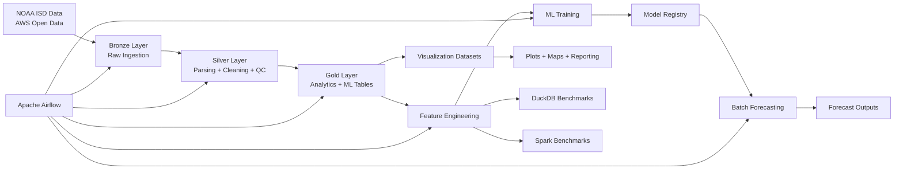

# Wind Energy Forecasting Pipeline

[]()
[]()
[]()
[]()
[]()
[]()
[]()
[]()

A production-style renewable energy forecasting platform built on NOAA Integrated Surface Database (ISD) data.

This project combines:

- large-scale distributed data engineering
- Spark-based ETL pipelines
- physics-informed wind energy modeling
- machine learning forecasting
- Apache Airflow orchestration
- cross-engine benchmarking
- analytical visualization
- and an upcoming live web platform for real-time wind estimation

The system was designed to simulate a realistic end-to-end data + ML platform capable of operating across local development and distributed cloud infrastructure.

---

# Project Objectives

The primary goals of this project are:

- build a scalable distributed forecasting pipeline using PySpark
- process NOAA ISD weather observations (~600GB+) efficiently
- convert raw meteorological observations into wind energy potential estimates
- engineer ML-ready forecasting datasets
- train and evaluate forecasting models for short-term wind prediction
- compare distributed vs single-node execution systems
- orchestrate workflows using Apache Airflow
- maintain reproducibility across users and environments
- package the entire system into a deployable portfolio-grade product

---

# High-Level Architecture



---

# Dataset: NOAA Integrated Surface Database (ISD)

Source:

- NOAA ISD (AWS Open Data)

Characteristics:

- hourly global weather observations
- ~35,000 stations
- years: 1901–2025
- encoded wide-schema CSV format
- 600GB+ uncompressed scale

---

# Project Scope

## Geographic Scope

Contiguous United States.

---

## Full Pipeline Window

1995–2025

---

## Local Development Scope

Development subset used for rapid iteration:

- California
- Texas
- Minnesota
- Florida

Years:

- 2018–2020

Approximate station scope:

- ~150 stations

---

# Core Weather Fields

The pipeline focuses on NOAA ISD weather fields relevant to wind forecasting.

| Field | Purpose |
|---|---|
| WND | wind speed + direction |
| TMP | temperature |
| DEW | dew point |
| VIS | visibility |
| CIG | ceiling |
| SLP | sea-level pressure |
| DATE | true observation timestamp |

---

# Important Engineering Constraints

Several important NOAA ISD characteristics influenced the pipeline design.

## Timestamp Handling

S3 object timestamps are not valid analytical timestamps.

All time logic uses:

```text
DATE
```

from the NOAA observations.

---

## Encoded Weather Fields

Many NOAA fields are encoded string payloads that require custom parsing logic.

The project includes dedicated parsers for:

- WND
- TMP
- DEW
- VIS
- CIG
- SLP

---

## Sparse Wide Dataset

The ISD dataset is extremely wide and sparse.

Version 1 intentionally focuses on:

- wind forecasting
- essential weather features
- scalable processing

rather than exhaustive field coverage.

---

# Technology Stack

## Distributed Processing

- PySpark
- Spark SQL
- Parquet

---

## Data Science

- Pandas
- NumPy
- PyArrow

---

## Machine Learning

- Spark MLlib
- Gradient Boosted Trees
- Random Forest
- Linear Regression

---

## Cloud Infrastructure

- AWS S3
- AWS EC2

---

## Workflow Orchestration

- Apache Airflow

---

## Benchmarking

- DuckDB
- Spark

---

## Visualization

- Plotly
- Datashader

---

## Upcoming Web Platform

- Next.js
- FastAPI
- XGBoost
- Vercel
- Render / Railway

---

# Repository Structure

```text
configs/               → runtime + Spark + user configuration
data/                  → raw samples + benchmark inputs
data_contracts/        → schema + mapping definitions
docs/                  → architecture, experiments, presentation, website plans
infra/                 → AWS + Airflow infrastructure
notebooks/             → validation + EDA + experiments
outputs/               → generated figures + metrics + artifacts
reports/               → final written reports
scripts/               → runnable orchestration + ETL scripts
src/                   → core pipeline source code
tests/                 → validation + unit tests
website_data/          → exported website-ready datasets

README.md
FINAL_REPORT.pdf
docker-compose.yml
pyproject.toml
uv.lock
```

---

# Source Code Organization

## Ingestion

```text
src/ingestion/
```

Handles:

- NOAA file discovery
- station filtering
- metadata loading
- raw ingestion

---

## Parsing

```text
src/parsing/
```

Contains dedicated parsers for NOAA encoded weather fields.

---

## Cleaning

```text
src/cleaning/
```

Handles:

- QC filtering
- null normalization
- sentinel value handling
- metadata enrichment
- unit standardization

---

## Storage

```text
src/storage/
```

Responsible for:

- bronze writes
- silver writes
- gold table generation
- repartitioning
- compaction

---

## Feature Engineering

```text
src/features/
```

Builds:

- lag features
- rolling statistics
- temporal features
- regional features

---

## Physics Modeling

```text
src/physics/
```

Implements:

- turbine-inspired power curves
- wind indices
- capacity factor logic

using Spark-native expressions.

---

## Machine Learning

```text
src/ml/
```

Contains:

- training pipelines
- tuning workflows
- dataset splitting
- inference logic
- model registry utilities

---

## Benchmarking

```text
src/benchmarking/
```

Implements:

- Spark benchmarks
- DuckDB benchmarks
- benchmark reporting

---

## Visualization

```text
src/visualization/
```

Generates:

- wind maps
- trend charts
- forecast validation plots
- seasonal visualizations

---

# Setup

## Install Dependencies

```bash
uv sync
```

---

## Activate Environment

```bash
source .venv/bin/activate
```

---

## Verify Environment

```bash
which python
```

---

# Configuration System

The pipeline is fully config-driven to support:

- multiple users
- different AWS environments
- local execution
- distributed execution
- reproducibility

---

## Never Hardcode

The project intentionally avoids hardcoding:

- S3 buckets
- EC2 hostnames
- Spark URLs
- runtime paths
- output directories

---

## Shared Configs

Located in:

```text
configs/
```

Includes:

- Spark settings
- runtime defaults
- schemas
- modeling configs
- project paths

---

## User Configs

Located in:

```text
configs/users/
```

Defines:

- AWS resources
- EC2 access
- runtime locations
- Spark master URLs

---

## Active Runtime Config

```bash
export PROJECT_USER_CONFIG=configs/users/syed.yaml
```

---

# Development Workflow

The project follows a scalable development pattern.

1. build locally on small samples
2. validate with notebooks + tests
3. scale to Spark cluster execution
4. validate distributed outputs
5. orchestrate via Airflow
6. export analytical artifacts
7. package for deployment

---

# End-to-End Pipeline Flow

```text
raw NOAA ingestion
→ parsing
→ cleaning
→ enrichment
→ standardization
→ aggregation
→ analytics
→ feature engineering
→ ML-ready datasets
→ model training
→ model evaluation
→ model registry
→ batch inference
→ forecast validation
→ visualization exports
```

---

# Data Processing

## Raw NOAA Structure

NOAA ISD data organization:

```text
year/station.csv
```

Each file represents:

- a station-year

Each row represents:

- a timestamped weather observation

---

# Cleaning and Quality Control

The cleaning stage performs:

- sentinel value replacement
- malformed record handling
- numeric parsing
- metadata joins
- quality filtering
- unit normalization

Examples:

```text
9999
+9999
```

converted into:

```text
NULL
```

---

# Data Lake Architecture

## Bronze Layer

Purpose:

- raw NOAA ingestion
- normalized ingestion schema
- resilient distributed loading

Output:

```text
s3a://<user-bucket>/bronze/isd
```

---

## Silver Layer

Purpose:

- parsed weather fields
- quality-controlled records
- standardized units
- metadata enrichment

Partitioning:

- year
- state

Output:

```text
s3a://<user-bucket>/silver/weather
```

---

## Gold Layer

Purpose:

- analytical datasets
- ML-ready datasets
- forecasting aggregates
- benchmark-ready tables

---

# Wind Energy Modeling

## Wind Potential Definition

Wind potential is represented using:

```text
capacity factor
```

normalized between:

```text
0 and 1
```

---

## Physics-Based Modeling

The project includes turbine-inspired wind logic:

- cut-in speeds
- rated speeds
- cut-out speeds
- wind power density estimation

All implemented using Spark-native transformations.

No Python UDFs are used in production ETL logic.

---

# Gold Analytical Outputs

## Daily Regional Wind Table

```text
s3a://<user-bucket>/gold/wind/analytics/daily_region
```

---

## Monthly State Wind Table

```text
s3a://<user-bucket>/gold/wind/analytics/monthly_state
```

---

## Extreme Event Table

```text
s3a://<user-bucket>/gold/wind/analytics/extreme_events
```

---

# Machine Learning Pipeline

## ML Base Table

```text
s3a://<user-bucket>/gold/wind/ml/base
```

---

## Feature Engineering

Feature generation includes:

- lag features
- rolling statistics
- temporal features
- weather aggregates
- regional features

---

## Dataset Splits

Time-based splitting strategy:

| Split | Years |
|---|---|
| Train | ≤ 2019 |
| Validation | 2020–2022 |
| Test | ≥ 2023 |

---

# Forecasting Models

Models evaluated:

- Baseline
- Linear Regression
- Random Forest
- Gradient Boosted Trees (GBT)

---

# Final Selected Model

```text
final_tuned_gbt
```

---

# Forecasting Performance

| Metric | Value |
|---|---|
| RMSE | ~0.042 |
| MAE | ~0.025 |

---

## Forecast vs Actual


---

# Model Registry

```text
s3a://<user-bucket>/models/registry/
```

---

# Batch Inference Outputs

Forecast outputs stored in:

```text
s3a://<user-bucket>/forecasts/outputs/
```

---

# Forecast Validation Metrics

| Metric | Value |
|---|---|
| MAE | ~0.0275 |
| RMSE | ~0.0455 |
| Bias | ~0 |

---

# Apache Airflow Orchestration

The project includes a production-style orchestration layer using Apache Airflow.

Main DAG:

```text
wind_pipeline_dag
```

---

## DAG Responsibilities

- config validation
- bronze ingestion
- silver generation
- gold table generation
- feature table generation
- model training
- evaluation
- model registration
- forecast generation
- validation

---

## Airflow Execution Modes

### Dry Run Mode

Used for:

- demonstrations
- DAG validation
- safe orchestration testing

---

### Full Execution Mode

Runs actual distributed workloads.

Example:

```bash
bash scripts/run_bronze_full_us.sh
```

---

# Airflow Observability

The Airflow environment supports:

- Graph View
- Gantt View
- task logs
- dependency tracing
- execution monitoring

---

## Airflow DAG Graph


---

# Benchmarking: DuckDB vs Spark

The project benchmarks:

- single-node analytical execution
vs
- distributed Spark execution

using equivalent workloads.

---

# Benchmark Tasks

Included benchmark operations:

- filtering
- aggregations
- grouped summaries
- metadata joins

---

# Benchmark Results

Key findings:

- DuckDB performs exceptionally well on smaller local workloads
- Spark incurs scheduling overhead
- Spark becomes necessary at larger distributed scales
- warm Spark runs improve performance

---

# Benchmark Outputs

```text
outputs/benchmark_results/
├── duckdb_benchmarks.csv
├── spark_benchmarks.csv
├── benchmark_comparison.csv
```

---

# Final Visual Outputs

## U.S. Wind Potential Map


---

## Regional Wind Trends


---

## Seasonal Wind Trends


---

# Testing

The repository includes unit and validation tests for:

- parsers
- unit conversions
- feature generation
- model IO
- quality filters
- power curve logic

Test suite location:

```text
tests/
```

---

# Current Website Platform Work

The project is currently being extended into a live portfolio-grade forecasting platform.

Planned capabilities include:

- live NOAA-powered wind estimation
- interactive forecasting dashboards
- pipeline storytelling
- benchmark visualizations
- deployable ML inference
- public cloud deployment

---

# Planned Website Stack

## Frontend

- Next.js
- TypeScript
- Plotly / Chart.js

---

## Backend

- FastAPI
- XGBoost portable inference
- NOAA API integration

---

## Deployment

- Vercel
- Render / Railway

---

# Website Product Direction

The upcoming website separates:

## Historical Pipeline Results

Precomputed artifacts exported from Spark:

- trends
- forecasts
- metrics
- benchmark outputs
- visualizations

from

## Live Wind Estimation

Real-time NOAA weather observations combined with:

- turbine-inspired power curve logic
- optional deployable ML inference

This ensures the platform remains functional even if EC2/S3 infrastructure expires.

---

# Current Website Planning Docs

```text
docs/website/
├── deployment_plan.md
├── live_prediction_design.md
└── product_spec.md
```

---

# Engineering Principles

Core project rules:

- all paths must come from config
- infrastructure must remain environment-agnostic
- timestamps must use true NOAA observation times
- orchestration must remain separate from business logic
- validation occurs before scaling
- portable artifacts should outlive cloud infrastructure

---

# Final Outcome

This project demonstrates:

- distributed data engineering
- scalable ETL architecture
- Spark-based processing
- ML forecasting systems
- Airflow orchestration
- benchmarking methodology
- reproducible infrastructure
- analytical visualization
- production-style packaging
- deployable forecasting platform design

---

# Ready For

- forecasting systems
- renewable energy analytics
- distributed ETL pipelines
- Airflow orchestration
- ML engineering workflows
- analytical dashboards
- live forecasting interfaces
- production deployment
- technical portfolio demonstrations
